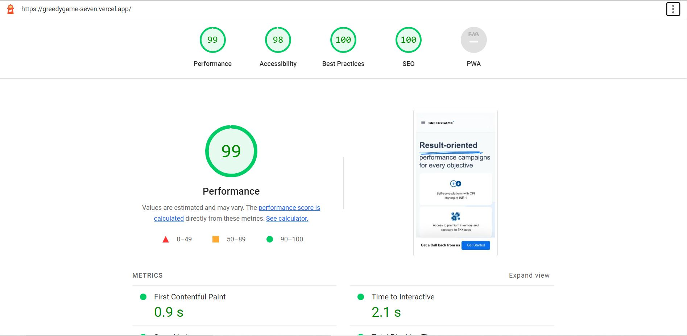
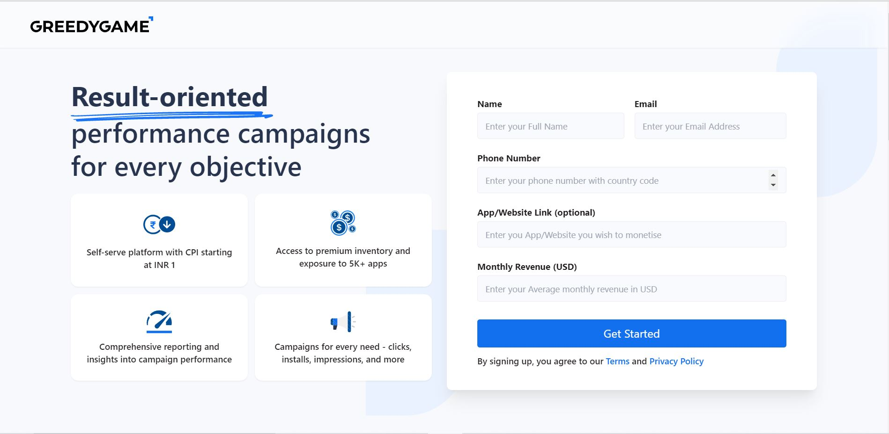

# Landing Page Assignment GreedyGame

## 👨‍💻 Live Demo

Try out the website : [Landing Page GreedyGame](https://greedygame-seven.vercel.app/)

## Features:

- Fully responsive website.
- A validation to visitor's contact information form which triggers clicking on .
- Added a sticky form and sticky navbar on desktop view.
- Added a footer navigation for finding the form with a smooth scroll effect in mobile view.

## Decisions:

- I use tailwind css to create that website to create it fast
- Try to use reusable elements
- maximum time I create a araay and using map function I iterate that
- organized file structure
- required images in public folder for accessibility to the images
- remove unnecessary file items
- I use direct svg to create that website

## Assumptions:

- Try to optimize the website
- Lighthouse report pretty good

## Lighthouse Report

## Available Scripts

In the project directory, you can run:

### `yarn install`

To install all the packages in package.json. This will install all the dependencies and devDependencies.

### `yarn dev`

Runs the app in the development mode.\
Open [http://localhost:3000](http://localhost:3000) to view it in the browser.

The page will reload if you make edits.

## Deploy on Vercel

The easiest way to deploy your Next.js app is to use the [Vercel Platform](https://vercel.com/new?utm_medium=default-template&filter=next.js&utm_source=create-next-app&utm_campaign=create-next-app-readme) from the creators of Next.js.

## 🚀 Project Output

